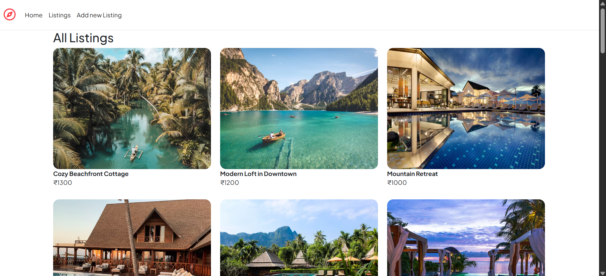
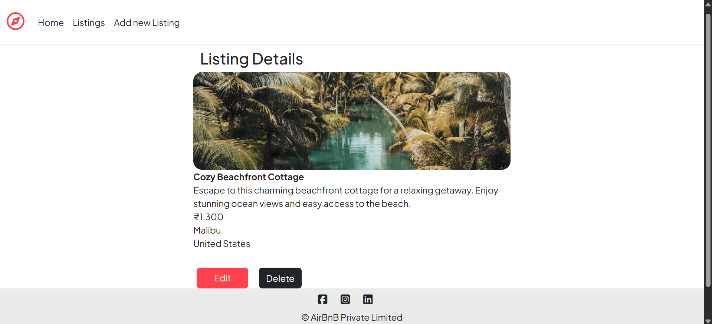
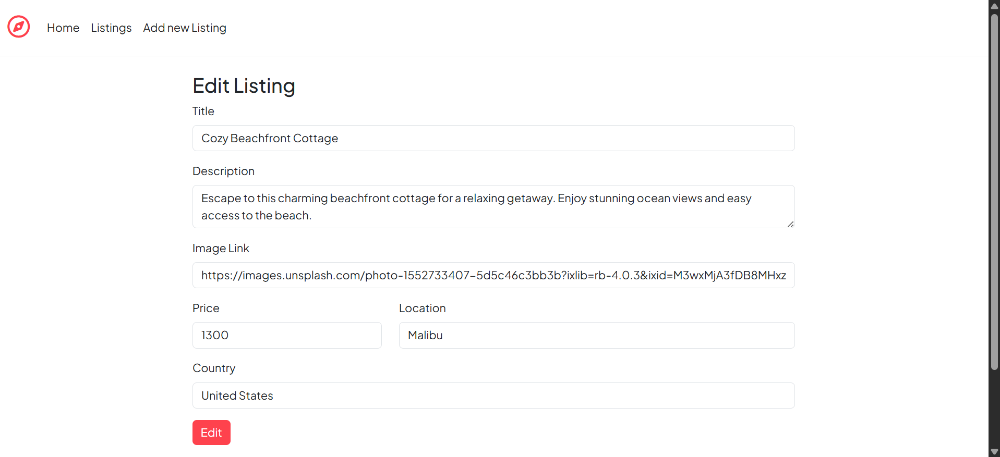
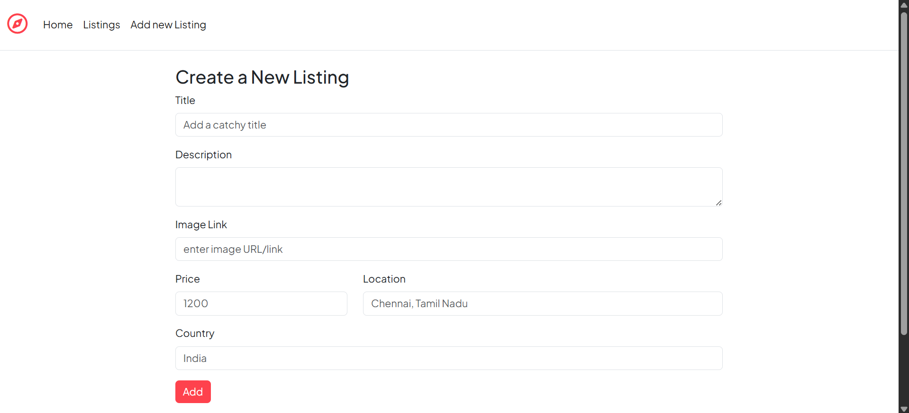

# Rental Listings App 🏠

A full-featured web application for posting and managing rental property listings. Users can view listings, add new ones, edit or delete existing ones, and view detailed information about each property. The app includes form validation, a clean UI, and a MongoDB backend for data persistence.

## 🌟 Features
- View all rental listings
- Add new listings with title, price, description, image, and location
- Edit or delete existing listings
- Server-side and client-side validation
- Responsive and intuitive UI

## 💻 Tech Stack
**Frontend:** HTML, CSS, Bootstrap, EJS  
**Backend:** Node.js, Express.js  
**Database:** MongoDB, Mongoose  
**Tools:** Git, VS Code

## 📁 Folder Structure
```
rental-listings-app/
├── models/           # Mongoose models
├── init/             # Initialize MOongoDB database
├── views/            # EJS templates
├── utils/            # Project Utilities
├── public/           # Static assets (CSS, JS, images)
├── app.js            # Main server file
```

## 📸 Screenshots





## 📜 License
This project is for educational purposes only.
